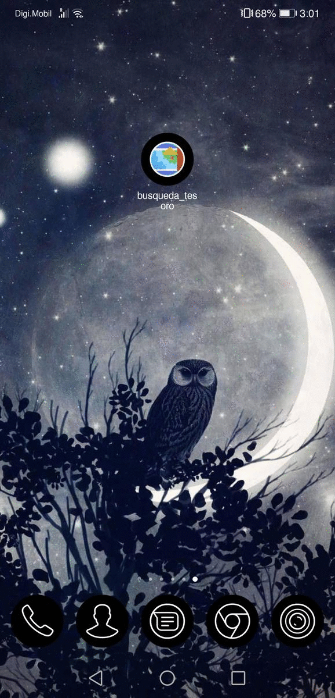
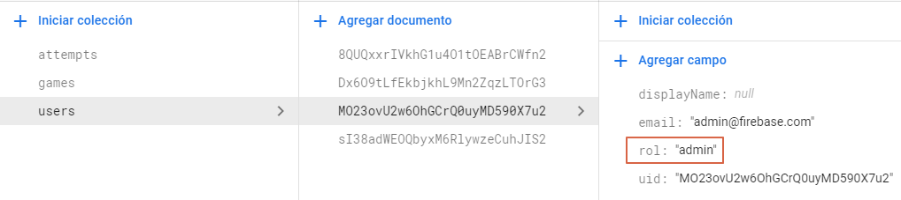

# Foobar

Looking For Treasures is an ionic app for simulating a play where you can get points attempting to guess the position of the treasure. The application has two users: admins and players. The admin is able to make the CRUD operations on games and play games from differents admins and the player only can play these.



## Technologies

- Ionic: 6.11.8
- npm: 6.14.5
- Angular: 11.2.10
- Firebase Authentication
- Firestore Database
- Firebase Storage

## Installation

Use the package manager [npm](https://www.npmjs.com/) to install Looking For Treasures.

```bash
npm install
```

In the file environment.ts you need this

```
export const environment = {
 production: false,
 firebaseConfig: {
   apiKey: "YOUR_API_KEY",
   authDomain: "YOUR_AUTH_DOMAIN",
   projectId: "YOUR_PROJECT_ID",
   storageBucket: "YOUR_STORAGE",
   messagingSenderId: "YOUR_MESSAGING",
   appId: "YOUR_APP_ID"
 }
};

```

In addtion, when you enter with a user first time you need to assing a rol in the document in Firestore Database



## Contributing

Pull requests are welcome. For major changes, please open an issue first to discuss what you would like to change.
